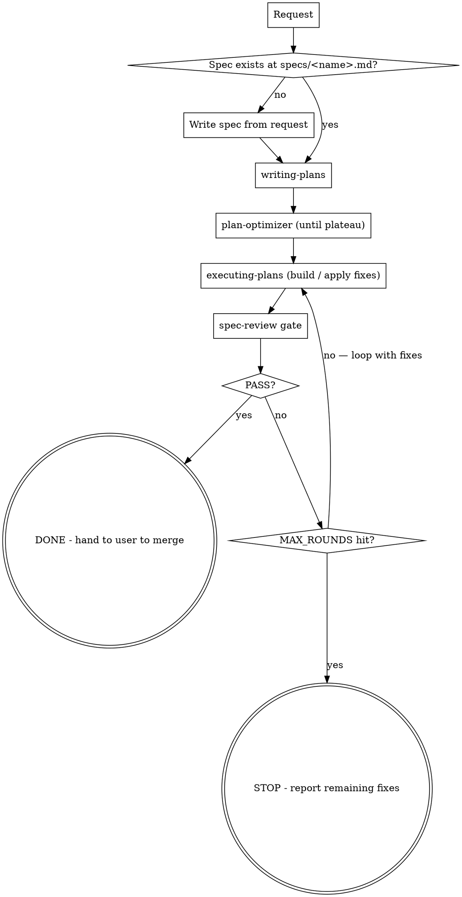

# Autopilot — Plan → Optimize → Build → Review, looped

## Overview

One prompt, the full delivery pipeline. You are the **orchestrator**: take a
feature request to a build that PASSES its spec gate by chaining four skills and
looping the build↔review step until the gate passes or a round cap is hit.
Invoke each sub-skill via the Skill tool, carry the artifact from each phase into
the next, and never declare done until spec-review returns PASS.

**Core rule:** the spec is the source of truth and **spec-review PASS is the
only successful exit.** On the round cap, stop and report the remaining fixes —
**never fake a PASS, never auto-merge.**

## Required sub-skills

- **REQUIRED:** superpowers:writing-plans
- **REQUIRED:** plan-optimizer
- **REQUIRED:** superpowers:executing-plans — this is the "build" step
- **REQUIRED:** spec-review

## The loop

## Phases

**Phase 0 — Spec (source of truth).** Ensure `specs/<name>.md` exists and
captures the requirements. If the user gave a request but no spec file, write
one: turn the request into numbered, testable requirements and save it. Confirm
`<name>` if ambiguous. The gate checks against this file, so it must be concrete.

**Phase 1 — Plan.** Invoke superpowers:writing-plans against `specs/<name>.md` to
produce the implementation plan.

**Phase 2 — Optimize.** Invoke plan-optimizer on that plan; run its
score→critique→rewrite loop until the score plateaus. Output: the hardened plan.

**Phase 3 — Build.** Invoke superpowers:executing-plans to implement the
optimized plan. On loop rounds after the first, pass spec-review's "Fixes for
/build" list in as the work items to address.

**Phase 4 — Gate.** Invoke spec-review against `specs/<name>.md`; it runs real
scenarios on the build.
- **PASS** → DONE. Report and hand to the user to merge.
- **FAIL** → take its "Fixes for /build" and return to Phase 3.

Loop Phase 3 ↔ 4 until PASS or `MAX_ROUNDS` (default **3**).

## Stop conditions (don't loop forever)

- **PASS** at Phase 4 → success, stop.
- **MAX_ROUNDS reached** → STOP, report the remaining FAIL items and fixes, hand
  to the user. Do **not** declare success.
- **No forward progress** → if a round closes zero of the previous round's gate
  failures, stop and surface it; the loop is stuck and needs a human.

## Checkpoints (autonomy vs. safety)

Default: run the loop autonomously, but **pause for human approval** at two
points, because building the wrong thing fast is worse than building it slowly:
1. After Phase 0 (the spec) and Phase 2 (the optimized plan) — confirm the target
   before building.
2. **Never auto-merge.** Autopilot ends at a green gate; the user merges.

If the user says "fully autonomous / no checkpoints", skip the plan-approval
pause but keep both hard rules: never fake a PASS, never auto-merge.

## Output per run

Report the phase you're in and the artifact it produced (plan, score trajectory,
build summary, gate verdict). Final output is either the gate's **PASS** verdict
plus a one-line summary of what shipped, or — on the cap — the remaining fixes.

## Common mistakes

- **Skipping Phase 0** → spec-review has nothing to check against. Always anchor
  on a written spec.
- **Treating the plan score as the exit.** The exit is spec-review PASS, not a
  high plan-optimizer score.
- **Looping past the cap.** Respect MAX_ROUNDS; a stuck loop needs a human.
- **Declaring done on a FAIL "to unblock".** The gate is the whole point.
